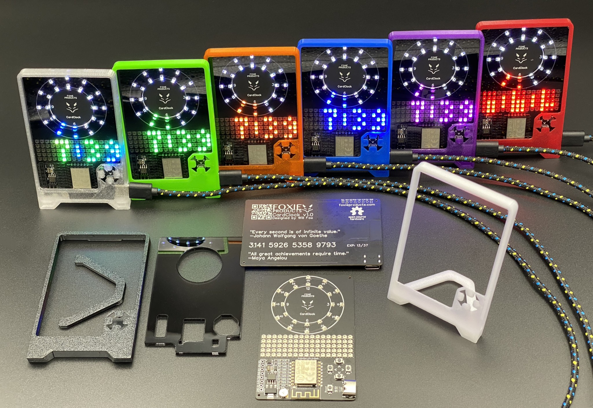

# Foxie CardClock

## A smart, colorful, credit card sized clock

This is the Foxie CardClock, a certified Open Hardware ([OSHW US002055](https://certification.oshwa.org/us002055.html)), ESP8266-powered, WiFi-enabled, RTC-havin', super-capacitor havin', analog+digital, LED-laden, clock. The firmware is also able to self-update from the web, so improvements to this firmware can make their way to everyone's clocks.

There are 2 rings of 12 LEDs at the top of the PCB, which are used to display Hours, Minutes and Seconds. The Minutes and Seconds display with a 5 minute/second resolution.

Enter the 17x5 LED matrix, including a library that has functions for drawing characters, scrolling, and more. All A-Z, 0-9 and most symbols are supported (see [characters.hpp](firmware/src/characters.hpp)). Easy-to-read source code. 

There are also 4 buttons for up/down/left/right navigation, and finally a reset button for the ESP8266 programming. Hold the **down** button, then press reset to enter UART **down**load mode. Too cool for serial programming? The CardClock firmware also supports ArduinoOTA and most firmware development can be done wirelessly, as long as you don't make the firmware unbootable... if you do, grab your USB-to-serial adapter and reprogram it easily. 

There is a light sensor using the ESP8266's single analog input, providing for a smooth experience in brighter and darker environments. Minimum and maximum brightness are also easily adjustable directly on the clock using the menu system.

The CardClock syncs NTP time once a minute from the WiFi connection. It also keeps track of time using the onboard RTC. Unplug your clock? No problem, the time isn't lost because the built-in super-capacitor will keep the RTC powered for over 2 days. The moment you plug it back in, the time is still there, and if on WiFi, will be NTP sync'd moments later. It's the little things, right?

You can even 3d-print your own [case](case/) easily with nearly any 3d printer or easily modify it, with the included .step file. 

The [PCB](pcb/) was designed with EasyEDA.

## Easy to hack

The CardClock is powered by an Ai-Thinker ESP-12F, one of several modules based on the Espressif ESP8266. The ESP-12F is the same chip as in the NodeMCU and Wemos D1 products... could you get a python version of the CardClock firmware running? Might be a fun project!

The source code is written in object-oriented C++, built using PlatformIO inside VS Code. It has ArduinoOTA support (DEVL mode must be enabled in the clock's menu), along with a safe mode (hold the **left** button on boot) just in case you manage to brick the firmware somewhere after the initialization. Although, I highly recommend having a USB to Serial cable (such as a CP2102 MICRO USB to UART TTL Module) around, just in case.

The firmware uses several open-source libraries, including [ESPAsyncWiFiManager](https://github.com/alanswx/ESPAsyncWiFiManager]), [Rtc_Pcf8563](https://github.com/elpaso/Rtc_Pcf8563), [Adafruit's NeoPixel library](https://github.com/adafruit/Adafruit_NeoPixel) and all the amazing work from the [ESP8266 Arduino core](https://github.com/esp8266/Arduino) team.

# [Get your own](https://www.foxieproducts.com/)

Order your own at [foxieproducts.com/products/cardclock](https://www.foxieproducts.com/products/cardclock) or at the [Foxie Products store on Tindie](https://www.tindie.com/products/foxieproducts/foxie-cardclock/).
