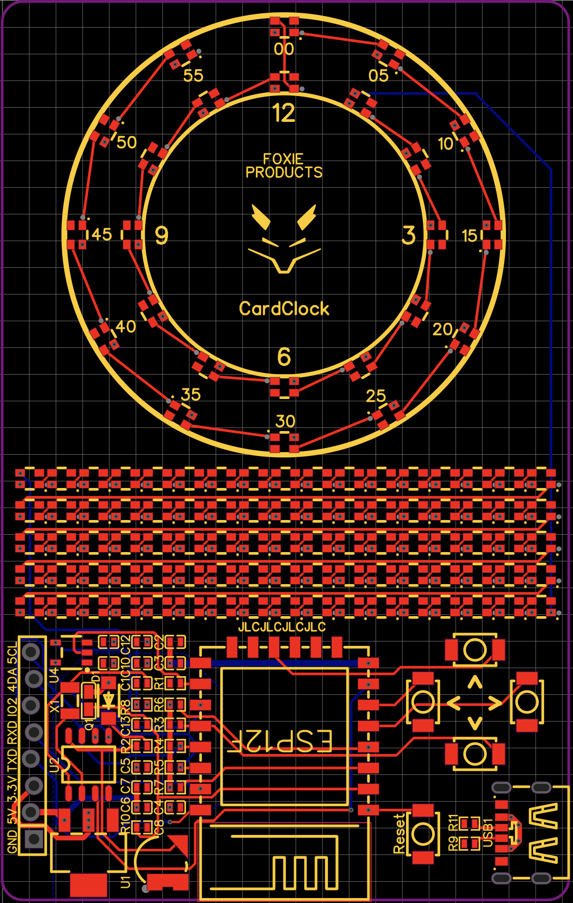
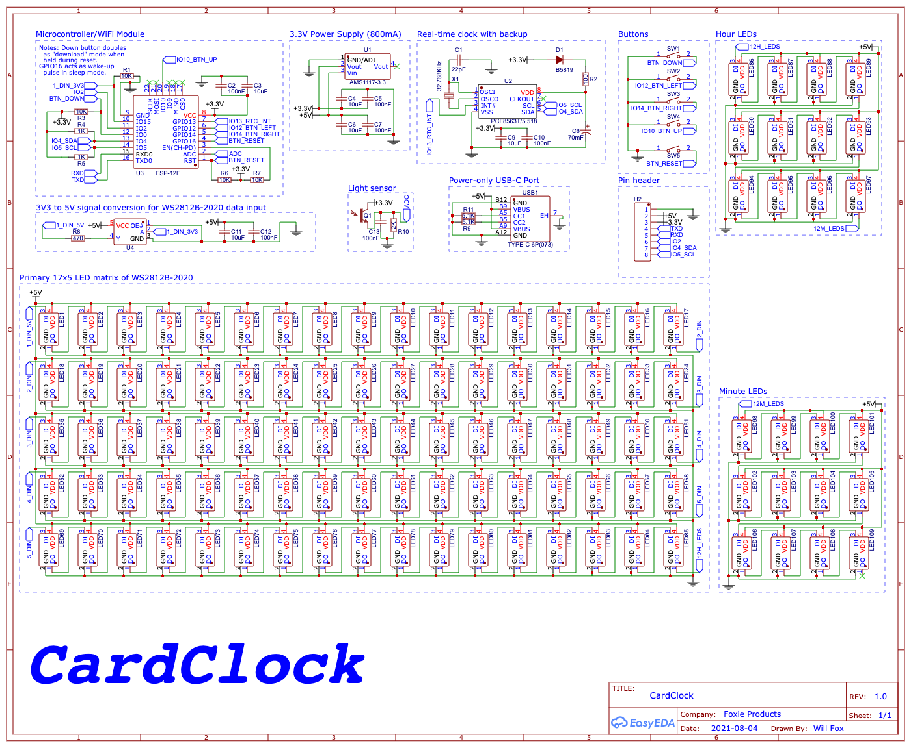

# Printed Circuit Board

The CardClock PCB top layer has a copper pour for the GND net, while the bottom has two: a 3.3v area under the primary component area and a 5v area everywhere else. 
There is also a keep-out area underneath the ESP-12F antenna area.

 

